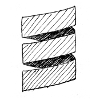
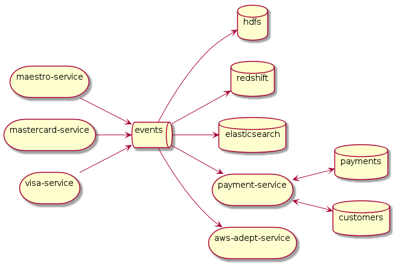
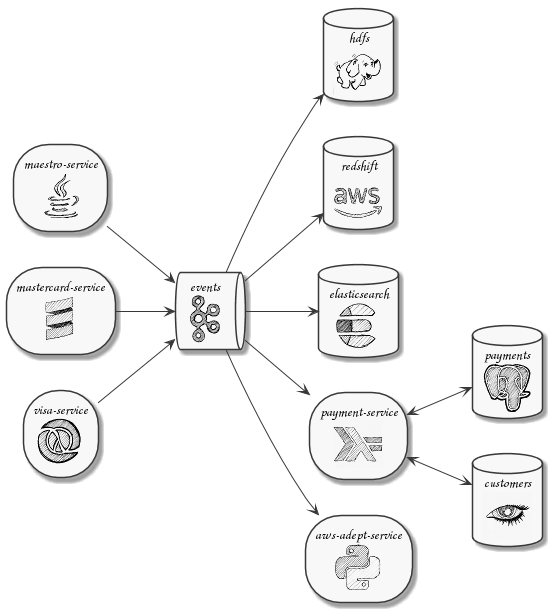
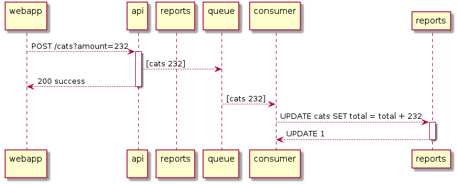
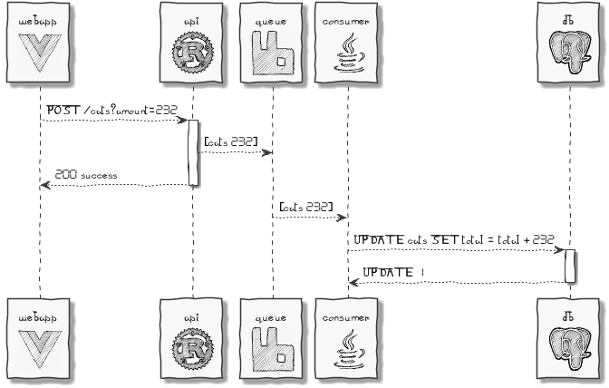

# puml-logo
*collection of 100x100 images to use in plantuml diagrams*

## Motivation
Diagram tooling is bad. Plantuml is a bit better then everything else but it is still a tool made by engineers for engineers.
A big advantage - it's embeddable in many document exchange systems (confluence) and other drawing tools (draw.io).
This is my attempt to make it a bit nicer for personal usage.

|  |   |        |     |     |        |
|---------------------------------|----------------------------------|--------------------------------------|---------------------------------|----------------------------------|--------------------------------------|
|  |   |     |  |    | |
|    |       |           |     |   |           |
| | |        |    |  |          |
|  |     |           |  |    |    |

## Samples

 
 
