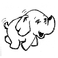

# puml-logo
*collection of 100x100 images to use in plantuml diagrams*

|  |   |        |     |     |        |
|---------------------------------|----------------------------------|--------------------------------------|---------------------------------|----------------------------------|--------------------------------------|
|  |   |     |  |    | |
|    |       |           |     |   |           |
| | |        |    |  |          |

## Samples

 `--->` 
 `--->` 
